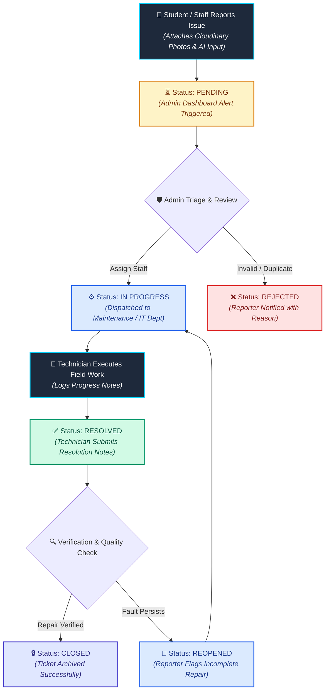
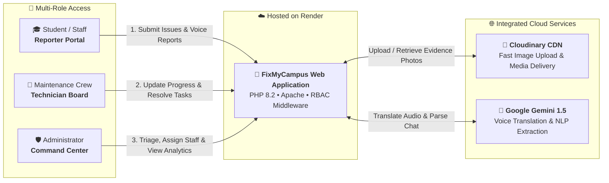

# 🏫 Campus Issue Tracker (FixMyCampus)

> **A centralized, cloud-hosted platform for reporting, managing, and resolving campus facility issues.** Fully deployed on **Render** with **Cloudinary** media storage and **Google Gemini AI** integration.

---

## 🌐 Live Website Access

You can directly explore the live production platform without any local installation:

### 🔗 **[Click Here to Launch FixMyCampus Live](https://campus-issue-tracker-main.onrender.com)**
`https://campus-issue-tracker-main.onrender.com`

---

### 🔑 Instant Demo Login Credentials

The live deployment on Render comes pre-loaded with active accounts for testing all user roles:

| Role | Email Address | Password | Portal Scope |
| :--- | :--- | :--- | :--- |
| **🛡️ Administrator** | `admin@fixmycampus.com` | `password123` | Master triage, analytics, staff assignment & user control |
| **🎓 Student (Reporter)** | `student@fixmycampus.com` | `password123` | Submit issues with photos, AI assistant, track live status |
| **👩‍🏫 Staff (Reporter)** | `staff@fixmycampus.com` | `password123` | Departmental facility reports & status history |
| **🔧 Maintenance Staff** | `maintenance@fixmycampus.com` | `password123` | View assigned work orders, update progress, log resolutions |
| **💻 IT Technician** | `tech@fixmycampus.com` | `password123` | IT & network tickets, add technical remarks & close |

---

## 📌 Project Overview

**Campus Issue Tracker (FixMyCampus)** is a web-based facility management application designed to eliminate paper logs, informal messages, and untracked complaints across educational institutions. 

The application is deployed on **Render Cloud** and utilizes **Cloudinary** for image storage and asset optimization, providing instant access from any device.

### 🌟 Key Highlights:
* ☁️ **Hosted on Render:** Containerized and continuously deployed on Render's cloud infrastructure for high availability.
* 📸 **Cloudinary Cloud Storage:** High-speed cloud photo storage and CDN delivery for all uploaded issue evidence.
* 🤖 **AI-Powered Reporting:** Integrated conversational AI assistant and multilingual voice translation to auto-fill ticket details.
* 👥 **Role-Based Access Control (RBAC):** Customized dashboards for Students, Faculty, Maintenance Teams, and Administrators.
* ⚡ **Live Status Tracking:** Real-time visibility through the entire lifecycle (`Pending` ➔ `In Progress` ➔ `Resolved` ➔ `Closed`).

---

## 🔄 Issue Lifecycle Flowchart

---

## ☁️ Cloud System Architecture

---

## ✨ Features by User Role

### 🎓 1. Students & Faculty (Reporters)
* **Smart Issue Reporting:** Submit maintenance complaints with categories, exact location, urgency level, and detailed descriptions.
* **Photo Evidence via Cloudinary:** Attach damage photos directly uploaded to Cloudinary CDN for instant verification.
* **AI Chat & Voice Assistant:** Describe problems in natural language or speak in regional languages (Hindi, Marathi, Konkani, etc.) with automatic English translation and field extraction.
* **Live Status & Timeline:** Track issue progress in real-time with full timestamped audit history and staff remarks.
* **Ticket Reopening:** Reopen tickets if repairs are incomplete or issues recur.

### 🔧 2. Staff & Maintenance Team (Technicians)
* **Assigned Work Orders:** Dedicated technician queue showing tickets dispatched by the administration.
* **Progress Logging:** Update ticket status to `In Progress` and log repair notes.
* **Resolution Documentation:** Mark work orders as `Resolved` with technical remarks and completion logs.
* **Instant Notifications:** Receive real-time alerts when new tasks are assigned or updated.

### 🛡️ 3. Administrators (Facility Overseers)
* **KPI Metrics Dashboard:** Overview of total complaints, pending issues, active repairs, resolution efficiency, and department breakdown.
* **Master Triage & Assignment:** Review incoming complaints and assign specialized technicians (Electrical, Plumbing, IT, Infrastructure, etc.).
* **Duplicate Complaint Clustering:** Group duplicate student complaints under a primary ticket with aggregated affected counts.
* **User & Role Management:** Manage registered accounts, departments, and access permissions.
* **Analytical Trend Reports:** Visual monthly charts and resolution performance analytics.

---

## 🛠️ Cloud & Technology Stack

| Component | Technology | Purpose |
| :--- | :--- | :--- |
| **Live Hosting** | **Render** | Cloud hosting running containerized PHP 8.2 & Apache environment |
| **Media & Storage** | **Cloudinary** | Cloud storage for issue evidence photos and CDN image delivery |
| **Backend** | **PHP 8.2** | Secure session management, RBAC routing, and business logic |
| **AI Integration** | **Google Gemini 1.5** | Natural language ticket parsing & multilingual voice translation |
| **Frontend** | **HTML5 / Vanilla JS** | Modern interactive UI and Web Speech API voice capture |
| **Styling** | **Custom Vanilla CSS3** | Dark-mode glassmorphic theme tokens and responsive layouts |
| **Icons** | **Bootstrap Icons** | Vector iconography across navigation and status badges |

---

## 🚀 Live Demo & Links

* 🔗 **Live Website:** [https://campus-issue-tracker-main.onrender.com](https://campus-issue-tracker-main.onrender.com)
* 📁 **Source Repository:** [https://github.com/krishashetdz/Campus-issue-Tracker](https://github.com/krishashetdz/Campus-issue-Tracker)

---

## 👥 Project Team

* 👨‍💻 **Kris Rodrigues**
* 👩‍💻 **Jeolita Parpatekar**
* 👩‍💻 **Krisha Shet** ([@krishashetdz](https://github.com/krishashetdz))

---

## ⚖️ License & Proprietary Notice

**Copyright © 2026. All Rights Reserved.**

This platform and its codebase are **proprietary and confidential**. Unauthorized copying, modification, distribution, or commercial deployment of this software is strictly prohibited without explicit written permission from the project creators.
