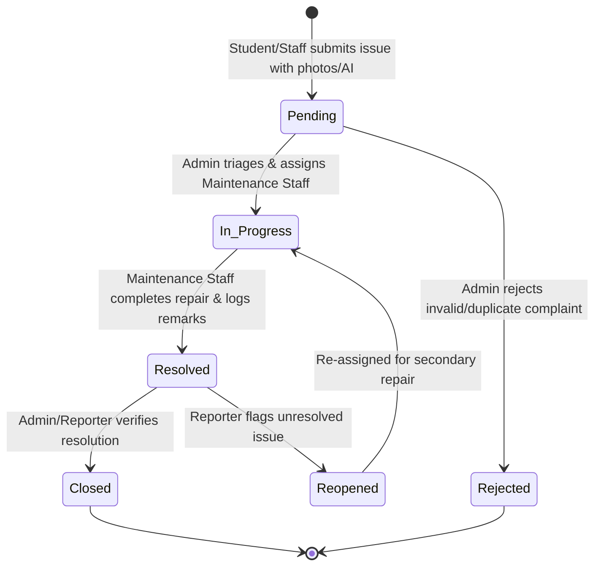

# 🏫 Campus Issue Tracker (FixMyCampus)

[](https://www.php.net/)
[](https://www.mysql.com/)
[](https://www.docker.com/)
[](https://ai.google.dev/)
[](https://cloudinary.com/)
[](README.md#license--proprietary-notice)

> **A modern, full-stack, enterprise-grade campus facility management platform.** Streamline issue reporting, automate maintenance dispatching, track real-time resolution lifecycles, and gain actionable operational insights across educational institutions.

---

## 📖 Table of Contents

- [About the Project](#-about-the-project)
  - [Problem Statement](#-problem-statement)
  - [The Solution](#-the-solution)
- [Key Features](#-key-features)
  - [Role-Based Access Control (RBAC)](#-role-based-access-control-rbac)
  - [Smart & AI-Powered Capabilities](#-smart--ai-powered-capabilities)
  - [Core Platform Capabilities](#-core-platform-capabilities)
- [System Architecture & Workflow](#-system-architecture--workflow)
  - [Issue Lifecycle Workflow](#issue-lifecycle-workflow)
  - [Layered Architecture Diagram](#layered-architecture-diagram)
- [Technology Stack](#-technology-stack)
- [Database Schema Overview](#-database-schema-overview)
- [Project Directory Structure](#-project-directory-structure)
- [Getting Started & Local Setup](#-getting-started--local-setup)
  - [Prerequisites](#prerequisites)
  - [Step 1: Clone Repository](#step-1-clone-repository)
  - [Step 2: Configure Environment Variables](#step-2-configure-environment-variables)
  - [Step 3: Database Provisioning](#step-3-database-provisioning)
  - [Step 4: Launch via Local Web Server (XAMPP / Apache)](#step-4-launch-via-local-web-server-xampp--apache)
  - [Alternative: Run with Docker](#alternative-run-with-docker)
  - [Default Demo Credentials](#default-demo-credentials)
- [API & Route Directory](#-api--route-directory)
- [Security & Reliability](#-security--reliability)
- [Contributing Guidelines](#-contributing-guidelines)
- [License & Proprietary Notice](#-license--proprietary-notice)

---

## 📌 About the Project

**Campus Issue Tracker (FixMyCampus)** is a centralized web application designed to digitize and optimize physical infrastructure maintenance, asset tracking, and facility operations across university and college campuses.

### ⚠️ Problem Statement
Academic institutions frequently suffer from operational bottlenecks caused by fragmented maintenance workflows:
* **Unstructured Channels:** Faults are reported verbally, through disconnected WhatsApp groups, or on physical logbooks where details get misplaced.
* **Zero Visibility:** Students and faculty receive no feedback on the progress of reported defects, causing confusion, frustration, and duplicate tickets.
* **Manual Dispatch Friction:** Facility administrators lack a centralized dashboard to prioritize urgent hazards, balance technician workloads, or track resolution SLAs.
* **Missing Audit Trails:** Lack of verifiable timestamped logs prevents administration from evaluating contractor performance or diagnosing recurrent hardware breakdowns.

### 💡 The Solution
FixMyCampus establishes a unified, transparent ecosystem bridging the gap between **reporters (students/faculty)**, **maintenance personnel**, and **administrators**:
* **Real-Time Visibility:** Every complaint moves through an immutable, timestamped lifecycle from submission to verification.
* **Visual & AI Evidence Capture:** Reporters can upload photo evidence or leverage the conversational Gemini AI assistant and multilingual voice translation.
* **Intelligent Triage & Duplicate Clustering:** Auto-detection groups duplicate complaints under a parent ticket to eliminate redundant dispatches.
* **Role-Specific Portals:** Clean, distraction-free workspaces tailored to students, technicians, and administrators.

---

## ✨ Key Features

### 👥 Role-Based Access Control (RBAC)

```
                       ┌─────────────────────────┐
                       │  FixMyCampus RBAC Guard │
                       └────────────┬────────────┘
         ┌──────────────────────────┼──────────────────────────┐
         ▼                          ▼                          ▼
┌──────────────────┐      ┌──────────────────┐      ┌──────────────────┐
│  Student / Staff │      │ Maintenance Team │      │  Administrator   │
│  Reporter Portal │      │ Technician Board │      │ Command Center   │
└──────────────────┘      └──────────────────┘      └──────────────────┘
```

#### 🎓 1. Students & Faculty (Reporters)
* **Interactive Issue Submission:** Log complaints with structured fields (Title, Category, Location, Priority, Detailed Description).
* **Multi-Image Evidence Upload:** Attach clear photos of defects with automatic client/server-side validation and Cloudinary CDN optimization.
* **Personal Report Dashboard:** Monitor all submitted tickets with live status badges (`Pending`, `In Progress`, `Resolved`, `Closed`, `Rejected`).
* **Audit Timeline Inspection:** View full status transition history, timestamps, and technician/admin remarks for every ticket.
* **Ticket Reopening:** Reopen tickets with feedback if an issue is prematurely marked resolved but the fault persists.
* **In-App Notification Center:** Receive immediate notifications when a ticket is assigned, in-progress, or marked completed.

#### 🔧 2. Staff & Maintenance Team (Technicians)
* **Assigned Work Orders Queue:** View tickets dispatched to your specific department (Electrical, IT, Plumbing, Carpentry, etc.).
* **Ticket Detail View:** Review reporter descriptions, exact campus locations, urgency levels, and attached photos.
* **Workflow Status Updates:** Transition tickets from `Pending` → `In Progress` → `Resolved` with detailed progress notes.
* **Resolution Documentation:** Record resolution remarks and technical details for administrative audit.
* **Real-Time Work Alerts:** Instant notification alerts upon new ticket assignments or escalations.

#### 🛡️ 3. Administrators (Facility Overseers)
* **Executive Metrics Dashboard:** Real-time KPI summaries including total complaints, pending issues, active repairs, resolution rates, and department performance.
* **Master Ticket Triage & Filter:** Filter complaints across multiple parameters (status, category, priority, reporter, assigned staff, date ranges).
* **Automated & Manual Technician Assignment:** Allocate tickets to specialized personnel with custom admin instructions.
* **Duplicate Complaint Clustering:** Link duplicate tickets to a primary parent ticket to aggregate affected student counts without cluttering queues.
* **Category & Department Management:** Maintain dynamic categories and assign corresponding visual icons.
* **User Management & RBAC Controls:** Search, filter, view activity, update user roles, and manage permissions across the institution.
* **Analytical Reporting:** Visual breakdowns of monthly issue trends, category distributions, and technician resolution metrics.

---

### 🤖 Smart & AI-Powered Capabilities

* **Conversational AI Reporter (Google Gemini 1.5 Flash):** Natural language chat assistant that converts plain English problem descriptions into structured tickets (extracts category, location, priority, and clear title).
* **Multilingual Voice Reporting:** Integrated Web Speech API with Gemini AI translation that accepts voice inputs in regional languages (Hindi, Marathi, Konkani, etc.), translates them to English, and populates ticket fields automatically.
* **Cloudinary CDN Integration:** Direct-to-cloud media storage supporting signed and unsigned uploads for ultra-fast, scalable photo inspection.
* **Duplicate Complaint Detection:** Identifies recurring keywords and location similarities, allowing admins to merge redundant tickets.

---

### ⚙️ Core Platform Capabilities

* **Status Lifecycle Engine:** Robust state-machine tracking transitions (`Pending` ➔ `In Progress` ➔ `Resolved` ➔ `Closed` / `Rejected` / `Reopened`).
* **Multi-Tier Priority Matrix:** Classify urgency from `Low`, `Medium`, `High`, to `Critical` emergency flags.
* **Modern Glassmorphic Dark UI:** Responsive design built with custom CSS tokens, modern typography, smooth transitions, and Bootstrap Icons.
* **Zero-Setup Database Auto-Migration:** Dynamic database bootstrapper that provisions SQL tables and schema updates seamlessly on startup.

---

## 🔄 System Architecture & Workflow

### Issue Lifecycle Workflow



### Layered Architecture Diagram

```
┌─────────────────────────────────────────────────────────────────────────┐
│                           PRESENTATION LAYER                            │
│  ┌────────────────────┐   ┌──────────────────────┐   ┌────────────────┐ │
│  │  Reporter Portal   │   │  Maintenance Portal  │   │  Admin Portal  │ │
│  │ (report_issue.php) │   │ (my_assignments.php) │   │ (dashboard.php)│ │
│  └─────────┬──────────┘   └──────────┬───────────┘   └────────┬───────┘ │
└────────────┼─────────────────────────┼────────────────────────┼─────────┘
             │                         │                        │
┌────────────┼─────────────────────────┼────────────────────────┼─────────┐
│            ▼                         ▼                        ▼         │
│                            APPLICATION LAYER                            │
│  ┌───────────────────────────────────────────────────────────────────┐  │
│  │  RBAC Guard & Session Auth Manager (includes/auth_check.php)       │  │
│  ├───────────────────────────────────────────────────────────────────┤  │
│  │  Notification & Timeline Event Engine (notification_helper.php)   │  │
│  ├───────────────────────────────────────────────────────────────────┤  │
│  │  AI Natural Language & Voice APIs (api/ai_chat_reporter.php)       │  │
│  ├───────────────────────────────────────────────────────────────────┤  │
│  │  Media Validation & Cloudinary Client (config/db.php)             │  │
│  └───────────────────────────────────┬───────────────────────────────┘  │
└──────────────────────────────────────┼──────────────────────────────────┘
                                       │
┌──────────────────────────────────────┼──────────────────────────────────┐
│                                      ▼                                  │
│                             DATA ACCESS LAYER                           │
│  ┌───────────────────────────────────────────────────────────────────┐  │
│  │            PDO Database Connection Driver (config/db.php)         │  │
│  └───────────────────────────────────┬───────────────────────────────┘  │
│                                      ▼                                  │
│  ┌───────────────────────────────────────────────────────────────────┐  │
│  │                      Relational MySQL Engine                      │  │
│  │    [users] ──< [issues] ──< [issue_images] / [status_history]     │  │
│  │                   └──< [notifications] / [categories]            │  │
│  └───────────────────────────────────────────────────────────────────┘  │
└─────────────────────────────────────────────────────────────────────────┘
```

---

## 🛠️ Technology Stack

| Domain | Technology / Tool | Version / Purpose |
| :--- | :--- | :--- |
| **Backend Core** | PHP | `v8.2+` (Native OOP/Procedural, secure session management) |
| **Database** | MySQL / MariaDB | `v8.0+` (Relational schema with foreign keys and indexes) |
| **Database Layer** | PHP Data Objects (PDO) | Secure prepared statements preventing SQL Injection |
| **Frontend Core** | HTML5 / Vanilla JavaScript | `ES6+` client logic, asynchronous fetch, SpeechRecognition |
| **Styling & UI** | Custom Vanilla CSS3 | Dark-theme glassmorphism tokens, Flexbox & CSS Grid |
| **Iconography** | Bootstrap Icons | `v1.11.3` vector iconography |
| **AI Integration** | Google Gemini API | `Gemini 1.5 Flash` for smart NLP ticket extraction & translation |
| **Media Hosting** | Cloudinary REST API | Cloud media upload with local fallback to `uploads/issues/` |
| **Web Server** | Apache HTTP Server | Web server with `mod_rewrite` & environment handling |
| **Containerization** | Docker | Production container image based on `php:8.2-apache` |

---

## 📊 Database Schema Overview

The database consists of 6 core normalized relational tables:

```
                  ┌──────────────┐
                  │    users     │
                  └──────┬───────┘
                         │ 1
                         │
                         │ *
                  ┌──────┴───────┐           ┌──────────────┐
                  │    issues    ├───────────┤  categories  │
                  └──────┬───────┘ *       1 └──────────────┘
                         │ 1
        ┌────────────────┼────────────────┐
        │ *              │ *              │ *
┌───────┴──────┐ ┌───────┴──────┐ ┌───────┴──────┐
│ issue_images │ │status_history│ │ notifications│
└──────────────┘ └──────────────┘ └──────────────┘
```

* **`users`**: Contains account profiles, bcrypt password hashes, contact details, departments, and roles (`student`, `staff`, `admin`, `maintenance`).
* **`categories`**: Stores maintenance categories (Electrical, Plumbing, IT, Cleanliness, Infrastructure, Furniture, Safety) and icons.
* **`issues`**: Central transactional records tracking location, priority, lifecycle status, assigned technician, reporter, and duplicate clustering IDs (`parent_id`, `is_parent`, `affected_count`).
* **`issue_images`**: Multi-image attachments linked to issues (`issue_id`) with secure URLs.
* **`status_history`**: Immutable audit logs capturing every status shift, modifier ID, timestamps, and notes.
* **`notifications`**: Targeted event-driven user alerts with read/unread flags.

---

## 📁 Project Directory Structure

```text
FixMyCampus/
├── admin/                          # Administrator Portal
│   ├── dashboard.php               # Overview statistics, KPIs & quick action panels
│   ├── issues.php                  # Master complaints repository & multi-filter
│   ├── notifications.php           # Administrative notification center
│   ├── reports.php                 # Analytics, charts, and resolution trends
│   ├── users.php                   # User accounts management & role editor
│   └── view_issue.php              # Ticket inspector, assignment & status manager
├── api/                            # Asynchronous API Endpoints
│   ├── ai_chat_reporter.php        # Gemini AI NLP ticket parsing endpoint
│   └── translate_voice_report.php  # Gemini AI voice & multilingual translation API
├── assets/                         # Static Assets
│   ├── css/                        # Custom CSS stylesheets & dark theme tokens
│   └── images/                     # Graphic illustrations and UI elements
├── bento-profile/                  # Interactive team showcase interface
│   └── index.html                  # Bento-style developer portfolio profile
├── config/                         # Core Configuration
│   └── db.php                      # PDO database connector & auto-migration engine
├── includes/                       # Shared Helpers & Partials
│   ├── auth_check.php              # RBAC guard & session validation middleware
│   ├── notification_helper.php     # Notification triggers & status audit dispatcher
│   ├── sidebar.php                 # Dynamic navigation sidebar partial
│   └── topbar.php                  # Header partial with live notifications
├── maintenance/                    # Maintenance Staff Portal
│   ├── dashboard.php               # Technician metrics & pending workload
│   ├── my_assignments.php          # Filtered queue of assigned work orders
│   ├── notifications.php           # Technician alerts & dispatch feed
│   └── update_issue.php            # Ticket updater, progress logs & resolution
├── reporter/                       # Student & Staff Portal
│   ├── dashboard.php               # Reporter dashboard & submission metrics
│   ├── my_issues.php               # Personal ticket history & status monitoring
│   ├── notifications.php           # User notification center
│   ├── reopen_issue.php            # Handler for reopening unresolved tickets
│   ├── report_issue.php            # Multi-modal report form (Manual, AI, Voice)
│   └── view_issue.php              # Ticket detail, status timeline & feedback
├── uploads/                        # Local File Storage
│   └── issues/                     # Local fallback storage for uploaded issue photos
├── .env.example                    # Environment variable configuration template
├── database.sql                    # Relational schema and initial seed dataset
├── Dockerfile                      # Apache/PHP 8.2 Docker configuration
├── index.php                       # Application landing page & authentication portal
├── logout.php                      # Session destruction & logout controller
└── register.php                    # User registration portal (Students / Staff)
```

---

## 🚀 Getting Started & Local Setup

### Prerequisites

Ensure the following dependencies are installed on your host system:
* **PHP:** `8.2.0` or higher (with `pdo`, `pdo_mysql`, `curl`, and `mbstring` extensions enabled)
* **Database:** MySQL `8.0+` or MariaDB `10.4+`
* **Web Server:** Apache (via XAMPP, WAMP, LAMP, MAMP) OR **Docker**
* **Git:** For repository cloning

---

### Step 1: Clone Repository

Clone the project into your local web root directory (e.g., `htdocs` for XAMPP):

```bash
# Navigate to web root
cd C:/xampp/htdocs/

# Clone repository
git clone https://github.com/krishashetdz/Campus-issue-Tracker.git fixmycampus

# Enter project directory
cd fixmycampus
```

---

### Step 2: Configure Environment Variables

Copy the provided `.env.example` template to configure your local or production environment:

```bash
cp .env.example .env
```

Edit `.env` (or set environment variables in your hosting dashboard):

```env
# Database Credentials
DB_HOST=localhost
DB_PORT=3306
DB_NAME=fixmycampus
DB_USER=root
DB_PASSWORD=

# Base URL (leave default for XAMPP subfolder or set for production)
BASE_URL=http://localhost/fixmycampus/

# Optional: Cloudinary CDN Credentials
CLOUDINARY_CLOUD_NAME=your_cloud_name
CLOUDINARY_API_KEY=your_api_key
CLOUDINARY_API_SECRET=your_api_secret
CLOUDINARY_UPLOAD_PRESET=your_upload_preset

# Optional: Google Gemini AI API Key (Enables AI Chat & Voice Assistant)
GEMINI_API_KEY=your_gemini_api_key
```

> **Note:** If `CLOUDINARY_*` keys are omitted, the application automatically defaults to storing uploaded images locally under `uploads/issues/`.

---

### Step 3: Database Provisioning

You can import the database using any of the following methods:

#### Method A: Automatic Auto-Migration (Recommended)
`config/db.php` will automatically detect missing tables and execute `database.sql` on first launch when the database connection is established.

#### Method B: Manual Import via MySQL CLI
```bash
mysql -u root -p -e "CREATE DATABASE IF NOT EXISTS fixmycampus CHARACTER SET utf8mb4 COLLATE utf8mb4_unicode_ci;"
mysql -u root -p fixmycampus < database.sql
```

#### Method C: Manual Import via phpMyAdmin
1. Open `http://localhost/phpmyadmin`
2. Create a new database named `fixmycampus`
3. Click the **Import** tab, select [database.sql](file:///c:/Users/krisj/Desktop/fixmycampus-main/database.sql), and click **Go**.

---

### Step 4: Launch via Local Web Server (XAMPP / Apache)

1. Start **Apache** and **MySQL** from your XAMPP Control Panel.
2. Open your web browser and navigate to:
   ```
   http://localhost/fixmycampus/
   ```
3. You will be greeted by the FixMyCampus login portal.

---

### Alternative: Run with Docker

Run the entire application in a containerized environment with a single command:

```bash
# 1. Build the Docker Image
docker build -t campus-issue-tracker .

# 2. Run the Container
docker run -d \
  -p 8080:80 \
  -e DB_HOST=host.docker.internal \
  -e DB_PORT=3306 \
  -e DB_NAME=fixmycampus \
  -e DB_USER=root \
  -e DB_PASSWORD=your_password \
  --name fixmycampus-app \
  campus-issue-tracker
```

Access the application at `http://localhost:8080`.

---

### 🔑 Default Demo Credentials

The pre-seeded dataset contains verified demo accounts for every role (`password` for all seeded accounts is `password123`):

| Role | Email Address | Password | Department / Scope |
| :--- | :--- | :--- | :--- |
| **Administrator** | `admin@fixmycampus.com` | `password123` | Central Administration |
| **Student (Reporter)** | `student@fixmycampus.com` | `password123` | Computer Science |
| **Faculty (Reporter)** | `staff@fixmycampus.com` | `password123` | Library Department |
| **Maintenance Staff** | `maintenance@fixmycampus.com` | `password123` | General Maintenance Dept |
| **IT Technician** | `tech@fixmycampus.com` | `password123` | IT & Network Services |

---

## 📡 API & Route Directory

### 🔐 Authentication Routes
* `GET / POST` [`index.php`](file:///c:/Users/krisj/Desktop/fixmycampus-main/index.php) — User authentication entry point.
* `GET / POST` [`register.php`](file:///c:/Users/krisj/Desktop/fixmycampus-main/register.php) — Registration for Students and Staff accounts.
* `GET` [`logout.php`](file:///c:/Users/krisj/Desktop/fixmycampus-main/logout.php) — Destroys session and redirects to login.

### 🎓 Reporter Routes (`/reporter/`)
* [`dashboard.php`](file:///c:/Users/krisj/Desktop/fixmycampus-main/reporter/dashboard.php) — Personal ticket analytics and quick reporting access.
* [`report_issue.php`](file:///c:/Users/krisj/Desktop/fixmycampus-main/reporter/report_issue.php) — Issue creation with AI chat and voice assistant support.
* [`my_issues.php`](file:///c:/Users/krisj/Desktop/fixmycampus-main/reporter/my_issues.php) — Full history of submitted tickets with status indicators.
* [`view_issue.php`](file:///c:/Users/krisj/Desktop/fixmycampus-main/reporter/view_issue.php) — Detailed ticket timeline, remarks, and reopening trigger.
* [`reopen_issue.php`](file:///c:/Users/krisj/Desktop/fixmycampus-main/reporter/reopen_issue.php) — Controller to reopen unresolved complaints.
* [`notifications.php`](file:///c:/Users/krisj/Desktop/fixmycampus-main/reporter/notifications.php) — Real-time notification inbox.

### 🔧 Maintenance Routes (`/maintenance/`)
* [`dashboard.php`](file:///c:/Users/krisj/Desktop/fixmycampus-main/maintenance/dashboard.php) — Active workload and completion metrics.
* [`my_assignments.php`](file:///c:/Users/krisj/Desktop/fixmycampus-main/maintenance/my_assignments.php) — Assigned work order registry.
* [`update_issue.php`](file:///c:/Users/krisj/Desktop/fixmycampus-main/maintenance/update_issue.php) — Transition ticket status and log technician remarks.
* [`notifications.php`](file:///c:/Users/krisj/Desktop/fixmycampus-main/maintenance/notifications.php) — Work assignment alert feed.

### 🛡️ Administrator Routes (`/admin/`)
* [`dashboard.php`](file:///c:/Users/krisj/Desktop/fixmycampus-main/admin/dashboard.php) — System-wide analytics, counts, and recent submissions.
* [`issues.php`](file:///c:/Users/krisj/Desktop/fixmycampus-main/admin/issues.php) — Global ticket filter, search, and bulk operations.
* [`view_issue.php`](file:///c:/Users/krisj/Desktop/fixmycampus-main/admin/view_issue.php) — Triage ticket, assign staff, link duplicate complaints.
* [`reports.php`](file:///c:/Users/krisj/Desktop/fixmycampus-main/admin/reports.php) — Comprehensive resolution performance reports.
* [`users.php`](file:///c:/Users/krisj/Desktop/fixmycampus-main/admin/users.php) — User directory, role assignment, and account control.
* [`notifications.php`](file:///c:/Users/krisj/Desktop/fixmycampus-main/admin/notifications.php) — Administrative event feed.

### ⚡ REST / AI Micro-Endpoints (`/api/`)
* `POST` [`api/ai_chat_reporter.php`](file:///c:/Users/krisj/Desktop/fixmycampus-main/api/ai_chat_reporter.php) — Accepts raw natural language text and returns structured ticket JSON via Google Gemini / NLP rule-engine.
* `POST` [`api/translate_voice_report.php`](file:///c:/Users/krisj/Desktop/fixmycampus-main/api/translate_voice_report.php) — Accepts speech transcripts in regional languages, translates them, and extracts ticket parameters.

---

## 🔒 Security & Reliability

* **Parameterized SQL Queries:** 100% of database queries execute through PDO prepared statements with native emulation disabled (`PDO::ATTR_EMULATE_PREPARES => false`) to eliminate SQL Injection vectors.
* **Bcrypt Password Security:** Passwords stored as one-way Bcrypt hashes using PHP's `password_hash()` standard.
* **XSS Sanitization:** User-generated inputs are sanitized via `htmlspecialchars()` prior to DOM rendering.
* **Strict Server-Side RBAC:** Middleware guards [`auth_check.php`](file:///c:/Users/krisj/Desktop/fixmycampus-main/includes/auth_check.php) validate session tokens and role scopes on every protected route.
* **File Upload Hardening:** Strict MIME-type whitelisting (`image/jpeg`, `image/png`, `image/webp`), 5MB payload caps, and randomized filename generation prevent malicious file execution.

---

## 🤝 Contributing Guidelines

This project is maintained for private / internal institutional use. If you are a member of the internal development team or an authorized collaborator, please adhere to the following workflow:

1. **Branching Strategy:**
   - Always branch off `main` using descriptive naming:
     - `feature/feature-name`
     - `bugfix/issue-description`
     - `hotfix/critical-patch`
2. **Commit Conventions:**
   - Write clear, imperatively phrased commit messages:
     - `feat: add duplicate complaint clustering in admin view`
     - `fix: resolve voice translation fallback parser exception`
     - `docs: update setup instructions and route directory`
3. **Local Testing:**
   - Verify all role flows (Reporter, Maintenance, Admin) locally before opening a Pull Request.
   - Ensure database queries adhere to PDO prepared statements.
4. **Pull Requests:**
   - Submit PRs against the `main` branch with a concise summary of changes and test steps.

---

## ⚖️ License & Proprietary Notice

**Copyright © 2026. All Rights Reserved.**

This repository and all associated software, schemas, documentation, and design assets are **proprietary and confidential**. Unauthorized copying, distribution, modification, public display, or commercial use of this software, in whole or in part, via any medium, is strictly prohibited without explicit written permission from the copyright holders.
